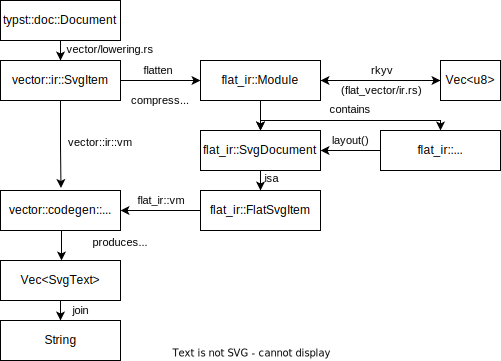
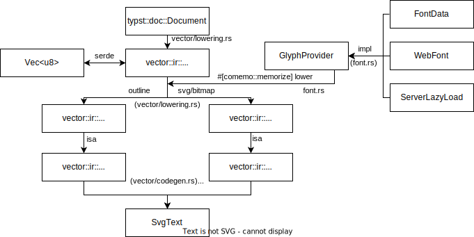
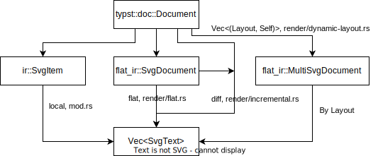

### Export as SVG

The `typst::doc::Document` is converted into a SVG document with three or four stages:

- Lowering: From `typst::doc::Document` to `vector::ir::SvgItem`
  - The `vector::ir::SvgItem` is one-to-one corresponding to the svg elements but is specialized for the `typst::doc::Document` structure.
  - simplified `typst::doc::Document`, so it is more friendly to `comemo::memorize`.
- (Optional) Flatten: From `vector::ir::SvgItem` to `flat_ir::FlatSvgItem`
  - Serializable
  - `flat_ir::FlatSvgItem` are referenced and deduplicated by `vector::ir::AbsoluteRef`.
- Generation: From `SvgItem/FlatSvgItem` to `Arc<vector::codegen::SvgText>`
  - Share same generation logic.
  - memorized by `comemo::memorize`.
- Output: From `Vec<vector::codegen::SvgText>` to `String`
  - Reserves the memory for the output string before the generation.

##### Conversion graph (items)

##### Conversion graph (glyph)

##### Render approaches

